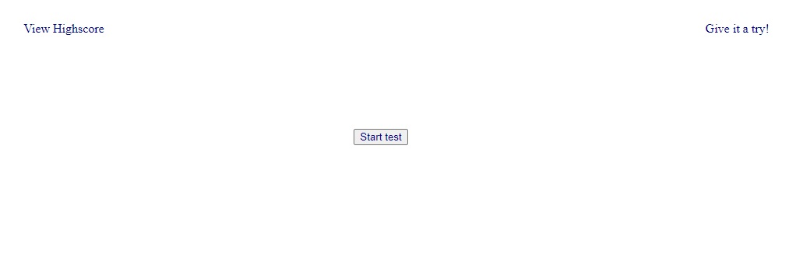
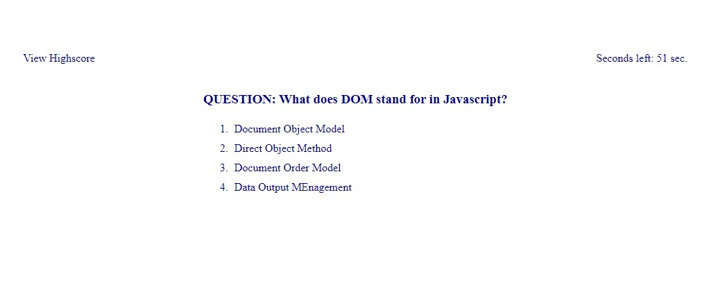
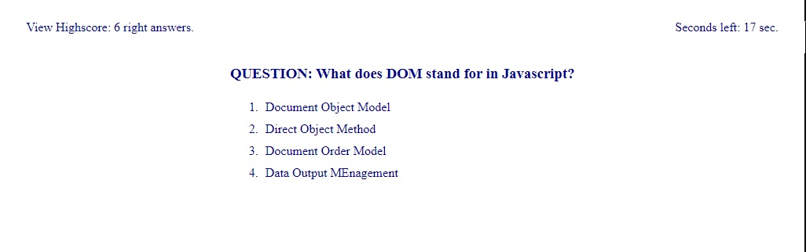
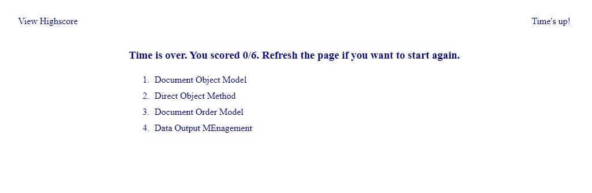

# CODING SKILLS TEST

https://leopoldogurgel.github.io/.../

## DESCRIPTION

This is a quizz application that will test your knowledge about Javascript and Web API. This was made using mostly this same technologies along some basic CSS and HTML. Have fun!

## INSTRUCTIONS

At the landing page you will find a highscore section, a start button and the placeholder for the timer, where you can read "Give it a try!"

If you click the start button, the first question will appear and your timer will start counting down from 60 seconds.
When you answer the question, the next one will will replace the
question you just answered.

If you click the highscore section, your highscore will be displayed. You can hide it by clicking on it again.

Whenever your timer reaches 0 or you answer the last question, your score will be displayed at the screen along a message telling you to refresh the page if you want to give it another try.

## LICENSE

MIT License

Copyright (c) [2023] [Leopoldo Gurgel Barroso Pimentel]

Permission is hereby granted, free of charge, to any person obtaining a copy
of this software and associated documentation files (the "Software"), to deal
in the Software without restriction, including without limitation the rights
to use, copy, modify, merge, publish, distribute, sublicense, and/or sell
copies of the Software, and to permit persons to whom the Software is
furnished to do so, subject to the following conditions:

The above copyright notice and this permission notice shall be included in all
copies or substantial portions of the Software.

THE SOFTWARE IS PROVIDED "AS IS", WITHOUT WARRANTY OF ANY KIND, EXPRESS OR
IMPLIED, INCLUDING BUT NOT LIMITED TO THE WARRANTIES OF MERCHANTABILITY,
FITNESS FOR A PARTICULAR PURPOSE AND NONINFRINGEMENT. IN NO EVENT SHALL THE
AUTHORS OR COPYRIGHT HOLDERS BE LIABLE FOR ANY CLAIM, DAMAGES OR OTHER
LIABILITY, WHETHER IN AN ACTION OF CONTRACT, TORT OR OTHERWISE, ARISING FROM,
OUT OF OR IN CONNECTION WITH THE SOFTWARE OR THE USE OR OTHER DEALINGS IN THE
SOFTWARE.